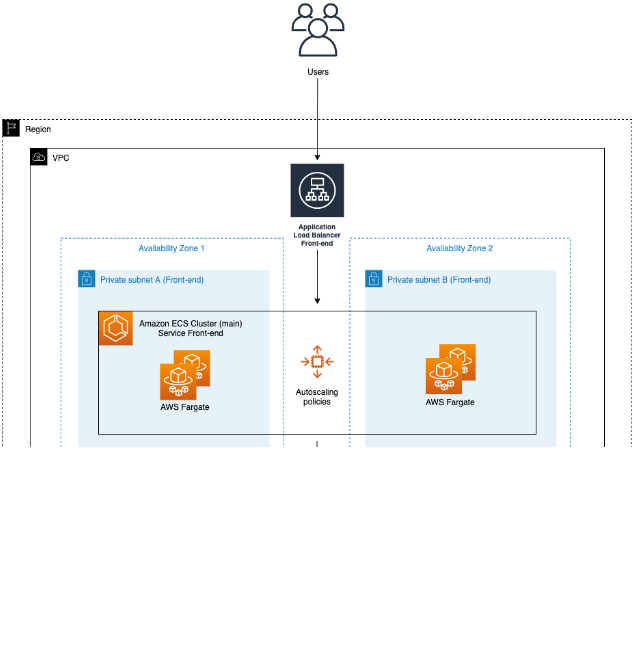

# Amazon ECS with Nginx Tasks + Autoscaling through Terraform

## Infrastructure Architecture

The following diagram represents the Infrastructure architecture being deployed with this project:

    

## Flow and Architecure

The code runs ECS fargate tasks on blue-green mode. 

Though the image (nginxdemos/hello) is publicly accessible , still assumption has been made that the docker image is stored in a private repo and the credentials of the repo is fetched from Secrets Manager by the ECS task definition.   

Autoscaling action can be integrated with SNS topic (which is not fully implemented here).  

ECS cluster launches containers as blue/green.  

Fargate tasks in the cluster are running across AZs to provide availaibility and fault tolerance to some extent.  

ALB ensures load is balanced between tasks spread across AZs  

